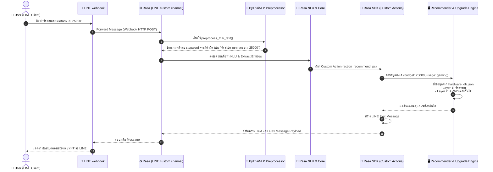

# 🖥️ SpecFlow: Computer Specification Recommendation & Upgrade Advising Chatbot

**SpecFlow** คือระบบแชทบอทอัจฉริยะสำหรับ **จัดสเปคคอมพิวเตอร์และแนะนำการอัปเกรดแบบอัตโนมัติ** ผ่านแพลตฟอร์ม **LINE** 
โดยผสานพลังของระบบสนทนา **Rasa Open Source** ร่วมกับโมเดลประมวลผลภาษาไทย **PyThaiNLP** 
เพื่อช่วยให้ผู้ใช้งานทั่วไปสามารถค้นหาสเปคคอมพิวเตอร์ที่เหมาะสมกับงบประมาณและการใช้งานของตนเองได้อย่างง่ายดายและชาญฉลาด

---

## 👥 บทบาทผู้ใช้งาน (User Roles)

ระบบตอบสนองต่อผู้ใช้งาน 2 กลุ่มหลัก ดังนี้:

| บทบาท | หน้าที่และความเกี่ยวข้องกับระบบ | รูปแบบการใช้งานหลัก |
| :--- | :--- | :--- |
| **👤 End User** (ผู้ใช้งานทั่วไป) | ลูกค้าหรือผู้ที่ต้องการคำแนะนำเกี่ยวกับสเปคคอมพิวเตอร์ | พิมพ์สอบถามทาง LINE เช่น ขอคำแนะนำจัดสเปคตามงบ หรือพิมพ์แจ้งสเปคปัจจุบันเพื่อขอคำแนะนำในการอัปเกรด |
| **🛠️ Administrator / Developer** (ผู้ดูแลระบบ) | ผู้พัฒนาและดูแลรักษาระบบเบื้องหลัง | อัปเดตราคาและรุ่นของฮาร์ดแวร์ในฐานข้อมูล (`hardware_db.json`), ปรับแต่งข้อมูลฝึกสอนแชทบอท (NLU data), พัฒนาตรรกะการจัดสเปค และตรวจสอบการทำงานของระบบ |

---

## ✨ คุณสมบัติของระบบ (Features)

* **🧠 Thai Natural Language Processing (NLP):**
  * **Thai Text Segmentation:** ตัดคำภาษาไทยเพื่อรองรับภาษาแชทตามธรรมชาติ
  * **Typo Normalization:** แก้ไขการพิมพ์สะกดผิดของอุปกรณ์ฮาร์ดแวร์โดยอัตโนมัติ (เช่น *กาดจอ* ➡️ *การ์ดจอ*, *เมนบอด* ➡️ *เมนบอร์ด*) ผ่าน Dictionary (`typo_dict.json`)
  * **Stopword Removal:** คัดกรองและลบคำฟุ่มเฟือยที่ไม่ส่งผลต่อความหมายการจัดสเปค (เช่น *ครับ*, *ค่ะ*, *อยากได้*, *ขอหน่อย*) เพื่อเพิ่มความแม่นยำให้แชทบอท
* **🖥️ Smart PC Builder (ระบบจัดสเปคคอมพิวเตอร์ 2 ชั้น):**
  * **Layer 1: Budget Allocation (การจัดสรรงบประมาณ)** — คำนวณและกระจายงบประมาณไปยังชิ้นส่วนต่าง ๆ (CPU, GPU, RAM, Storage, Mainboard, PSU, Case, Cooler) ตามประเภทการใช้งานจริง เช่น
    * *Gaming:* เน้นความแรงของการ์ดจอ (GPU 40%) และซีพียู (CPU 30%)
    * *Video Editing / Graphic Design:* เน้นการประมวลผลซีพียู (CPU 35%) แรม (RAM 20%) และการ์ดจอ (GPU 30%)
    * *Office / General Use:* เน้นความประหยัดและความเร็วในการอ่านข้อมูล (Storage 25%, CPU 35%)
  * **Layer 2: Compatibility Rules (การตรวจสอบความเข้ากันได้)** — ตรวจเช็คความเข้ากันได้อย่างเข้มงวดก่อนจัดสเปค:
    * เช็ค Socket ของ CPU และ Motherboard ว่าตรงกัน
    * เช็คประเภทของหน่วยความจำ RAM ว่าเข้ากับ Motherboard (DDR4 หรือ DDR5)
    * เช็คขนาดเมนบอร์ด (Form Factor) ให้รองรับกับเคสคอมพิวเตอร์
    * คำนวณอัตราการใช้พลังงานรวม (TDP) ของ CPU และ GPU พร้อมเพิ่ม Buffer 100W เพื่อแนะนำ Power Supply (PSU) ที่มีกำลังไฟเพียงพอ
    * เช็ค CPU Socket ว่าพัดลมระบายความร้อน (Cooler) รองรับหรือไม่
  * **Future Upgrade Support:** รองรับทางเลือกสำหรับการเผื่ออัปเกรดในอนาคต โดยระบบจะบังคับเลือกเฉพาะ Socket รุ่นใหม่ล่าสุด (เช่น AM5 หรือ LGA1700) และหน่วยความจำประเภท DDR5 เท่านั้น
* **📈 Upgrade Advisor (ระบบแนะนำการอัปเกรด):**
  * วิเคราะห์ข้อมูลสเปคคอมพิวเตอร์ปัจจุบันของผู้ใช้เพื่อตรวจหาคอขวด (เช่น แรมต่ำกว่า 8GB, ยังใช้ฮาร์ดดิสก์แบบจานหมุน HDD)
  * แนะนำอุปกรณ์ทดแทนพร้อมประเมินค่าใช้จ่ายรวมโดยประมาณ
* **💬 LINE Chatbot Integration:**
  * เชื่อมต่อกับ LINE Messaging API โดยตรงผ่าน custom channel
  * แสดงสเปคคอมพิวเตอร์ที่จัดเสร็จแล้วในรูปแบบ **LINE Flex Message** การ์ดที่มีการจัด Layout สวยงาม สแกนอ่านง่าย และแสดงราคาแยกชิ้นส่วนอย่างชัดเจน

---

## 🔁 ขั้นตอนการทำงานของระบบ (System Workflow)

กระบวนการตั้งแต่ผู้ใช้ส่งข้อความบน LINE จนถึงการได้รับการ์ดสเปคคอมพิวเตอร์ ทำงานตามลำดับดังนี้:



---

## 📂 โครงสร้างโปรเจกต์ (Project Structure)

```text
SpecFlow/
├── app/
│   ├── rasa/                   # 🤖 โครงสร้างสำหรับแชทบอท Rasa
│   │   ├── actions/            # โค้ดของ Custom Actions ที่เชื่อมต่อกับบริการจัดสเปค
│   │   │   ├── actions.py      # ตัวประสาน Rasa SDK กับ SpecRecommender / UpgradeAdvisor
│   │   │   └── flex.py         # ฟังก์ชันสร้างโครงสร้างข้อมูล LINE Flex Message
│   │   └── line_channel.py     # ตัวเชื่อมต่อแบบ Custom สำหรับสื่อสารกับ LINE API
│   │
│   ├── scripts/                # 📜 สคริปต์เสริมในการประมวลผลข้อมูล
│   │   ├── generate_hardware_db.py # สคริปต์สุ่ม/สร้างฐานข้อมูลฮาร์ดแวร์จำลอง
│   │   └── preprocess_nlu_data.py   # สคริปต์จัดการข้อความภาษาไทยก่อนเทรนโมเดล
│   │
│   └── services/               # ⚙️ บริการจัดการข้อมูลและตรรกะระบบ
│       ├── nlp/                # โมดูลตัดคำและทำความสะอาดข้อความภาษาไทย
│       │   ├── preprocessing.py # คลาสหลักที่ใช้ PyThaiNLP
│       │   └── typo_dict.json   # พจนานุกรมคำผิด/คำเฉพาะสำหรับแผงวงจรคอมพิวเตอร์
│       │
│       └── recommendation/     # เครื่องคำนวณและประมวลผลคำแนะนำ
│           ├── hardware_db.json # ฐานข้อมูลฮาร์ดแวร์จำลอง
│           ├── spec_recommender.py # สมองจัดสเปค (Layer 1 & 2)
│           └── upgrade_advisor.py  # ตรรกะวิเคราะห์และแนะนำการอัปเกรด
│
├── config/                     # ⚙️ ไฟล์ตั้งค่าระบบของ Rasa
├── data/                       # 🗄️ ข้อมูลสำหรับเทรนบอท Rasa (raw & processed)
├── docs/                       # 📄 เอกสารคู่มือเพิ่มเติม
├── requirements/               # 📦 รายการ dependencies แยกตามส่วนการทำงาน
│   ├── ai.txt                  # ไลบรารี AI & NLP (pythainlp)
│   ├── rasa.txt                # ไลบรารีหลักสำหรับแชทบอท (rasa, rasa-sdk, line-bot-sdk)
│   └── backend.txt             # (ถ้ามี) สำหรับส่วนต่อขยาย
├── tests/                      # 🧪 โฟลเดอร์เก็บโค้ดสำหรับรัน Unit Test
│   └── test_nlp_preprocessing.py
├── run.py                      # ไฟล์หลักสำหรับรันระบบ (Entrypoint)
└── README.md                   # เอกสารประกอบการใช้งานระบบชิ้นนี้
```

---

## ⚙️ วิธีการติดตั้งและเริ่มใช้งาน (Getting Started)

### 1. การเตรียมสภาพแวดล้อม (Prerequisites)
* แนะนำให้ใช้งาน **Python 3.8 - 3.10**
* ทำการติดตั้ง Virtual Environment และเปิดใช้งานก่อนเริ่มติดตั้ง:
  ```bash
  python -m venv venv
  # สำหรับ Windows (PowerShell):
  .\venv\Scripts\Activate.ps1
  ```

### 2. การติดตั้ง Dependencies
ดำเนินการติดตั้งไลบรารีที่จำเป็นผ่านโฟลเดอร์ `requirements`:
```bash
pip install -r requirements/ai.txt
pip install -r requirements/rasa.txt
```

### 3. การรันการทดสอบ (Running Unit Tests)
คุณสามารถรันการตรวจสอบความถูกต้องของระบบประมวลผลคำภาษาไทยได้โดย:
```bash
python -m unittest tests/test_nlp_preprocessing.py
```

### 4. การรันระบบและใช้งานแชทบอท (Running SpecFlow Server)

1. **การเทรนโมเดลแชทบอท (Train Rasa Model):**
   หากมีการปรับเปลี่ยนข้อมูลฝึกสอนในโฟลเดอร์ `data/` หรือแก้ไขไฟล์ตั้งค่าการตัดคำ ให้ทำการเทรนโมเดลใหม่ก่อน:
   ```bash
   cd app/rasa
   ..\..\venv\Scripts\rasa train
   cd ../..
   ```

2. **การเปิดใช้งานระบบเซิร์ฟเวอร์ทั้งหมดในจุดเดียว (All-in-One Start):**
   คุณสามารถเปิดการทำงานของ Rasa Server, Action Server และ Ngrok Tunneling ได้พร้อมกันผ่านจุดเดียวโดยรันสคริปต์:
   ```bash
   python run.py
   ```
   *หมายเหตุ: สคริปต์จะเริ่มทำงานเซิร์ฟเวอร์ย่อยทั้งหมดในพื้นหลังแบบอัตโนมัติ และคุณสามารถสั่งหยุดการทำงานของเซิร์ฟเวอร์ทั้งหมดพร้อมกันเพื่อคืนค่าพอร์ตได้ทันทีโดยการกด `Ctrl+C` ที่หน้าต่างคอมมานด์นี้ครับ*

---
📄 **License:** MIT License
