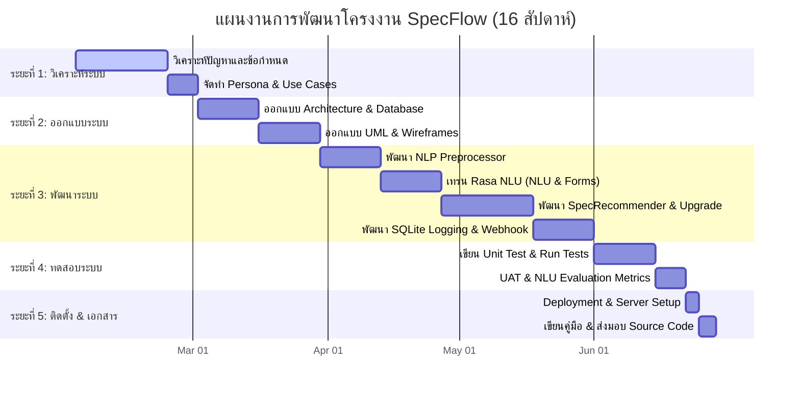

# S03: แผนงาน ระยะเวลา และความเสี่ยง (Project Plan, Timeline, and Risk Management)

---

## 1. โครงสร้างการแบ่งสรรงาน (Work Breakdown Structure - WBS)

การดำเนินโครงการพัฒนาแชทบอทจัดสเปกคอมพิวเตอร์และเพิ่มประสิทธิภาพการทำงาน (SpecFlow) แบ่งรายละเอียดขั้นตอนการปฏิบัติงานออกเป็น 5 ระยะหลัก ดังนี้:

### ระยะที่ 1: การศึกษาความต้องการและวิเคราะห์ระบบ (System Initiation & Requirements)
* **1.1 วิเคราะห์ขอบเขตและปัญหาของระบบจัดสเปคคอมพิวเตอร์แบบเดิม**
* **1.2 รวบรวมข้อกำหนดทางเทคนิค (Functional & Non-functional Requirements)**
* **1.3 ออกแบบ Persona, User Journey Map และระบุสิทธิ์ความรับผิดชอบ (Role/Permission)**
* **1.4 จัดทำการบันทึกเอกสารความต้องการเริ่มต้น (S01, S02)**

### ระยะที่ 2: การออกแบบเชิงสถาปัตยกรรม (System & Architecture Design)
* **2.1 ออกแบบสถาปัตยกรรมการสื่อสารข้อมูลร่วมกับแพลตฟอร์ม LINE (Custom Webhook)**
* **2.2 ออกแบบโครงสร้างฐานข้อมูลคลังอุปกรณ์ (JSON Schema) และโครงสร้างประวัติทำรายการ (SQLite Schema)**
* **2.3 ออกแบบ UML Diagrams (Use Case, Activity, Sequence, Class Diagrams)**
* **2.4 ออกแบบหน้าจอโต้ตอบความสวยงาม (Wireframe, UI Design System, LINE Flex Message Templates)**

### ระยะที่ 3: การพัฒนาระบบประยุกต์ (System Implementation & Coding)
* **3.1 พัฒนาโมดูลพรีโปรเซสภาษาไทยและการจัดการคำสะกดผิดทางด้านฮาร์ดแวร์ (ThaiPreprocessor)**
* **3.2 ติดตั้งและฝึกฝนโมดูล Rasa NLU Core (Intents, Entities, Rules, Forms)**
* **3.3 พัฒนาสมองจัดสรรงบประมาณและกฎความเข้ากันได้ทางวิศวกรรม (SpecRecommender)**
* **3.4 พัฒนาตรรกะประเมินประสิทธิภาพเดิมและวิเคราะห์ภาวะคอขวด (UpgradeAdvisor)**
* **3.5 พัฒนาส่วนบันทึกข้อมูล SQLite และการออกรายงานวิเคราะห์ (Analytics Logger)**
* **3.6 พัฒนาและเชื่อมต่อช่องทางเข้าออกข้อความ Custom LINE Channel Webhook**

### ระยะที่ 4: การตรวจสอบประสิทธิภาพและการประเมิน (Testing & Evaluation)
* **4.1 เขียนชุดทดสอบย่อยเพื่อตรวจสอบสเปคความเข้ากันได้ (Unit Testing for Compatibility Rules)**
* **4.2 ดำเนินการทดสอบการตีความข้อความและคำนวณสถิติความแม่นยำ (Rasa NLU evaluation test)**
* **4.3 การทำแบบทดสอบระดับบูรณาการ (Integration/System Test) และการทำ UAT ร่วมกับกลุ่มตัวอย่าง**

### ระยะที่ 5: การส่งมอบและติดตั้งระบบจริง (Deployment & Final Documentation)
* **5.1 ตั้งค่าการรันเซิร์ฟเวอร์หลัก, ติดตั้ง Ngrok Webhook Tunnel, และทดสอบระบบโหมดใช้งานจริง**
* **5.2 จัดทำเอกสารคู่มือสำหรับผู้ใช้ทั่วไป คู่มือผู้ดูแลระบบ และรายงานโครงงานฉบับสมบูรณ์**

---

## 2. แผนการดำเนินงานและแผนภูมิแกนต์ (Project Timeline & Gantt Chart)

โครงการนี้มีกำหนดระยะเวลาดำเนินงานรวมทั้งสิ้น **16 สัปดาห์ (4 เดือน)** เริ่มตั้งแต่วันที่ **2 กุมภาพันธ์ 2026** ถึงวันที่ **29 มิถุนายน 2026** โดยสามารถสรุปแผนภูมิแกนต์ในรูปแบบ Mermaid Gantt Chart ได้ดังนี้:

---

## 3. แผนการจัดรอบการพัฒนา (Sprint Planning)

ระบบยึดระเบียบวิธีการพัฒนาซอฟต์แวร์แบบ **Agile Framework** โดยแบ่งรอบพัฒนาออกเป็น **4 Sprints** (รอบละ 4 สัปดาห์) ดังนี้:

### Sprint 1: รากฐานและความต้องการระบบ (สัปดาห์ที่ 1 - 4)
* **เป้าหมาย (Sprint Goal):** สร้างแบบจำลอง Use Case และสถาปัตยกรรมเอกสารให้ครบถ้วน รวมถึงสร้าง mock up หน้าตา UI
* **งานที่ดำเนินการ:** วิเคราะห์ความต้องการเชิงระบบ, รวบรวมฟังก์ชันการจัดสเปคและการอัปเกรด, ออกแบบผังฐานข้อมูลและ JSON Schema, ร่างหน้าจอ LINE Flex Message บนกระดาษ (Wireframes)

### Sprint 2: สมองกลและการประมวลผลภาษา (สัปดาห์ที่ 5 - 8)
* **เป้าหมาย (Sprint Goal):** พัฒนาระบบตัดคำภาษาไทยให้มีความแม่นยำ และเตรียม Rasa NLU pipeline
* **งานที่ดำเนินการ:** พัฒนาตัวจัดการคำภาษาไทยและการสะกดคำผิด (`preprocessing.py` และ `typo_dict.json`), เขียนตัวจำแนกเจตนาและเตรียมประโยคตัวอย่างใน `nlu.yml`, ทำการพรีโปรเซสไฟล์เทรนและเริ่มสั่งเทรน Rasa โมเดลรุ่นทดสอบ

### Sprint 3: ตรรกะเชิงวิศวกรรมคอมพิวเตอร์และการเชื่อมต่อ (สัปดาห์ที่ 9 - 12)
* **เป้าหมาย (Sprint Goal):** พัฒนาโมดูลจัดสเปคคอม ตรรกะแนะนำการอัปเกรด และเชื่อมต่อกับ LINE Platform
* **งานที่ดำเนินการ:** พัฒนาตัวจับคู่อุปกรณ์ตรวจสอบความเข้ากันได้ (`spec_recommender.py`), พัฒนาตรรกะวิเคราะห์คอขวดคอมพิวเตอร์เดิม (`upgrade_advisor.py`), พัฒนาและเชื่อมต่อ Custom Webhook line channel (`line_channel.py`) เพื่อเชื่อมเข้ากับ SDK ของ LINE

### Sprint 4: บูรณาการ ตรวจสอบความถูกต้อง และส่งมอบ (สัปดาห์ที่ 13 - 16)
* **เป้าหมาย (Sprint Goal):** ทดสอบความปลอดภัยความเข้ากันได้ 100%, รวบรวมข้อมูลสถิติประเมินผล และนำโปรแกรมขึ้นระบบจริง
* **งานที่ดำเนินการ:** พัฒนาและบันทึกประวัติการใช้ลงใน SQLite (`analytics.db`), จัดทำรายงานสรุปการสืบค้นเพื่อการทดสอบบทที่ 4 (`analytics_report.py`), รันการทดสอบ Unit Tests และ NLU Evaluation Metrics, จัดการข้อผิดพลาด (Error Handling), จัดทำคู่มือและส่งมอบระบบจริง

---

## 4. การวิเคราะห์และการบริหารจัดการความเสี่ยง (Risk Assessment and Mitigation)

การระบุความเสี่ยงเชิงเทคนิคและการจัดสรรแผนบริหารจัดการ เพื่อจำกัดผลกระทบที่อาจเกิดต่อการดำเนินโครงงาน:

### 4.1. ตารางวิเคราะห์ระดับความเสี่ยง (Risk Matrix)

| รหัสความเสี่ยง | เหตุการณ์ความเสี่ยง (Risk Event) | โอกาสเกิด (Probability) | ผลกระทบ (Impact) | ระดับความเสี่ยง (Risk Level) |
| :--- | :--- | :--- | :--- | :--- |
| **RK1** | ความไม่แม่นยำในการตัดคำภาษาไทยและการสกัดตัวแปร | ปานกลาง (3/5) | สูง (4/5) | **สูง (12/25)** |
| **RK2** | ความหน่วงเวลาในการตอบกลับเกินมาตรฐานของ LINE | สูง (4/5) | ปานกลาง (3/5) | **สูง (12/25)** |
| **RK3** | ความผันผวนของราคาและความล้าสมัยของข้อมูลฮาร์ดแวร์ | สูง (4/5) | ปานกลาง (3/5) | **สูง (12/25)** |
| **RK4** | ปัญหาการจำกัดการใช้งานพอร์ตและการหลุดของ Ngrok Tunnel | ปานกลาง (3/5) | สูง (4/5) | **สูง (12/25)** |

### 4.2. แผนควบคุมและบรรเทาความเสี่ยง (Risk Mitigation Plan)

#### RK1: ความไม่แม่นยำในการตัดคำภาษาไทยและการสกัดตัวแปร
* **ผลกระทบ:** บอทตอบไม่ตรงเจตนาของผู้ใช้ หรือประมวลผลสเปคผิดพลาดเนื่องจากดึงงบประมาณและข้อมูลชิ้นส่วนเดิมไม่ได้
* **แนวทางแก้ไข (Mitigation Strategy):**
  1. สร้างเลเยอร์ทำความสะอาดล่วงหน้า (Pre-processing) เพื่อลบคำสร้อยหางเสียงแชทที่ไม่เป็นประโยชน์ และแปลงสะกดคำศัพท์ไอทีภาษาไทยให้ตรงกับ Entity ที่เทรนไว้
  2. จัดโครงสร้าง Regex สกัดรูปแบบงบประมาณเป็นตัวเลขตัวกรองพิเศษในตรรกะ Python ป้องกันกรณีบอทสกัดค่า Entity ผิดพลาด
  3. เขียนฟังก์ชันกรองและพรีโปรเซสข้อมูล NLU Training Data เสมอก่อนรัน `rasa train`

#### RK2: ความหน่วงเวลาในการตอบกลับเกินมาตรฐานของ LINE (Response Latency)
* **ผลกระทบ:** LINE Webhook กำหนดเวลา Time Out ไว้ที่ 5.0 วินาที หากใช้เวลาวิเคราะห์นานเกินไปจะเกิดระบบขัดข้อง
* **แนวทางแก้ไข (Mitigation Strategy):**
  1. การจัดเรียงและสืบค้นข้อมูลอะไหล่จากคลัง JSON ใช้การโหลดฐานข้อมูลขึ้นหน่วยความจำแบบเก็บพัก (Cache) ตั้งแต่เริ่มโหลดโปรเซส ไม่ทำการอ่านเขียนไฟล์ใหม่ทุกครั้งที่มีข้อความแชท
  2. ควบคุมความเร็วในการสืบค้นข้อมูลประวัติของ SQLite โดยทำการเขียน/อ่านแบบเรียบง่ายและจำกัดการจอยตาราง (Join) ที่ซับซ้อน

#### RK3: ความผันผวนของราคาและความล้าสมัยของข้อมูลฮาร์ดแวร์
* **ผลกระทบ:** สเปคที่แนะนำอาจมีราคาล้าสมัยหรือมีอุปกรณ์ที่ไม่มีการจำหน่ายจริงในตลาดการค้า
* **แนวทางแก้ไข (Mitigation Strategy):**
  1. ออกแบบไฟล์ฐานข้อมูล `hardware_db.json` ให้แยกจากส่วนตรรกะระบบ ทำให้ผู้ดูแลระบบแก้ไขข้อมูลได้โดยตรงโดยไม่ต้องหยุดหรือแก้ไขโค้ดการทำงานของโปรแกรมหลัก
  2. จัดเตรียมเครื่องมือสคริปต์อัตโนมัติ `generate_hardware_db.py` สำหรับให้แอดมินแก้ไขรายการและราคา แล้วสั่งเขียนทับได้ทันทีอย่างรวดเร็ว

#### RK4: ปัญหาการจำกัดการใช้งานพอร์ตและการหลุดของ Ngrok Tunnel
* **ผลกระทบ:** การเชื่อมต่อ LINE API ขัดข้องเนื่องจาก URL ชั่วคราวของ Ngrok เปลี่ยนไปทุกครั้งที่เริ่มรันระบบใหม่
* **แนวทางแก้ไข (Mitigation Strategy):**
  1. พัฒนาสคริปต์เปิดรันแบบ All-in-One (`run.py`) ที่จะทำการบูท Ngrok และ Rasa ขึ้นมาพร้อมกัน โดยแสดงผลลิงก์ URL ปัจจุบันชัดเจนบนหน้าจอคอนโซลเพื่อให้ผู้พัฒนานำไปสลับค่า Webhook ได้สะดวกรวดเร็ว
  2. ในระยะยาว (เมื่อ Deployment) แนะนำให้ปรับไปใช้การเช่าโดเมนเนมหรือจดทะเบียน Static URL ของ Ngrok เพื่อความมั่นคงถาวรในการทดสอบ
