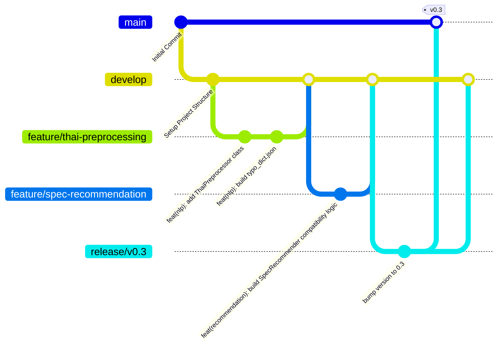

# S04: โครงสร้างคลังจัดเก็บและระบบควบคุมเวอร์ชัน (Repository and Version Control Specification)

---

## 1. ข้อมูลคลังจัดเก็บซอร์สโค้ด (Git Repository Details)
โครงการพัฒนาแชทบอท SpecFlow ได้รับการบริหารจัดการโค้ดบนระบบควบคุมเวอร์ชันแบบกระจายศูนย์ (Distributed Version Control System - DVCS) ของ Git ร่วมกับแพลตฟอร์มคลังจัดเก็บออนไลน์ของ GitHub:

* **ชื่อระบบคลังจัดเก็บหลัก (Git Repository Name):** `YadaKleebmuang/SpecFlow`
* **ระบบการจัดเก็บหลัก:** GitHub Cloud Repository
* **รูปแบบการจัดเก็บสิทธิ์เข้าถึง:** Private Repository (จำกัดสิทธิ์เฉพาะกลุ่มผู้พัฒนาและอาจารย์ที่ปรึกษา)

---

## 2. โครงสร้างโฟลเดอร์ของซอร์สโค้ด (Folder Structure Analysis)

โครงสร้างโฟลเดอร์ของโครงการ SpecFlow ถูกจัดแบ่งสัดส่วนตามสถาปัตยกรรมโมดูลอย่างชัดเจน เพื่อให้ง่ายต่อการแบ่งงานและป้องกันความขัดแย้งของการแก้ไขซอร์สโค้ด (Merge Conflicts) ดังรายละเอียดตารางต่อไปนี้:

| ไดเรกทอรี / ไฟล์ | บทบาทและหน้าที่ต่อระบบ (Roles & Responsibilities) |
| :--- | :--- |
| **`app/`** | โฟลเดอร์หลักบรรจุซอร์สโค้ดแอปพลิเคชันทั้งหมด |
| `app/rasa/` | โครงสร้างและคอนฟิกูเรชันหลักของเฟรมเวิร์ก Rasa Open Source |
| `app/rasa/actions/` | โค้ด Custom Action Server (Rasa SDK) รันที่พอร์ต 5055 |
| `app/rasa/actions/templates/` | แม่แบบข้อความการ์ดสเปคคอม LINE Flex Message (.json) |
| `app/rasa/data/` | ไฟล์ข้อมูลที่ใช้เทรน NLU (nlu.yml, rules.yml, stories.yml) |
| `app/rasa/line_channel.py` | ตัวเชื่อมต่อแบบกำหนดเอง (Custom Input/Output Channel) กับ LINE API |
| `app/rasa/thai_tokenizer.py` | คลาสตัดคำภาษาไทย Custom Tokenizer ที่ทำงานร่วมกับ Rasa NLU pipeline |
| `app/scripts/` | สคริปต์เสริมช่วยงานพัฒนาระบบหลังบ้าน |
| `app/services/` | ตรรกะงานประมวลผล (Business Logic) แยกจากโครงสร้าง Rasa |
| `app/services/nlp/` | โมดูลล้างคำหางเสียงและแก้ไขคำเขียนสะกดผิด (ThaiPreprocessor) |
| `app/services/recommendation/` | โมดูลคำนวณสเปค แชทตรวจสอบความเข้ากันได้ และวิเคราะห์คอขวดระบบ |
| `app/services/response/` | โมดูลคัดกรองจัดทำรายงานผลสถิติจาก SQLite |
| **`data/`** | จัดเก็บฐานข้อมูลของระบบ โดยเฉพาะไฟล์ SQLite (`analytics.db`) |
| **`docs/`** | แหล่งรวมเอกสารการวิเคราะห์ระบบทั้งหมด (S01 - S28) |
| **`requirements/`** | โฟลเดอร์จัดเก็บ dependencies แยกตามเป้าหมาย (ai.txt, rasa.txt) |
| **`tests/`** | รวบรวมสคริปต์ Unit Test, Integration Test และตัวสรุปผล NLU metrics |
| **`run.py`** | สคริปต์หลักเขียนด้วย Python สำหรับบูตระบบเซิร์ฟเวอร์ทั้งหมดในคำสั่งเดียว |
| **`README.md`** | เอกสารแนะนำการติดตั้งระบบและรันคำสั่งเบื้องต้นสำหรับผู้เริ่มต้น |

---

## 3. กลยุทธ์การบริหารสาขาของซอร์สโค้ด (Branching Strategy)

โครงการยึดกลยุทธ์การแตกสาขาโค้ดตามมาตรฐาน **GitFlow Workflow** เพื่อให้กระบวนการอัปเกรดระบบมีความเสถียรและสอดรับกับรอบการพัฒนา (Sprint Planning) ใน S03:

### รายละเอียดหน้าที่ของแต่ละสาขา (Branch Roles)
1. **`main` (Production Branch):**
   * บรรจุซอร์สโค้ดรุ่นที่ผ่านการตรวจสอบคุณภาพและมีความเสถียร 100% เท่านั้น
   * ห้ามทำการ Commit หรือ Push โค้ดตรงไปที่สาขานี้เด็ดขาด
   * การอัปเดตจะทำผ่านการ Merge จากกิ่ง `release/` หรือ `hotfix/` เท่านั้น และทุกการเมิร์จจะถูกแปะป้ายเวอร์ชัน (Git Tag v0.x)
2. **`develop` (Development Branch):**
   * เป็นสาขาหลักสำหรับการรวบรวมฟังก์ชันการทำงานใหม่ๆ จากทีมพัฒนา
   * ใช้สำหรับตรวจสอบการทำงานระดับ Integration Test ก่อนจัดทำ Release
3. **`feature/` (Feature Branches):**
   * แตกออกไปจาก `develop` สำหรับพัฒนาระบบย่อยทีละส่วน เช่น:
     * `feature/thai-preprocessing` (พัฒนาการตัดคำ)
     * `feature/spec-recommendation` (พัฒนาการคำนวณและกฎความเข้ากันได้)
     * `feature/upgrade-advisor` (พัฒนาตรรกะคอขวด)
     * `feature/line-webhook` (เชื่อมต่อ LINE API)
   * เมื่อทำเสร็จจะยื่นเสนอ Pull Request เพื่อนำกลับมารวมเข้ากับ `develop` และจะทำการลบสาขาย่อยนี้ทิ้งทันที
4. **`release/` (Release Branches):**
   * แตกออกไปจาก `develop` เมื่อฟังก์ชันพร้อมเข้าสู่การทดสอบ UAT และทำระบบส่งมอบ (เช่น `release/v0.3`)
   * ใช้ทำการแก้ข้อผิดพลาดเล็กน้อย (Bug fixes) ก่อนที่จะถูกผสานเข้าสู่ `main` และ `develop`
5. **`hotfix/` (Hotfix Branches):**
   * แตกสาขาออกไปโดยตรงจาก `main` กรณีพบข้อผิดพลาดร้ายแรงบน Production (เช่น Webhook Signature Verification เสียหาย) 
   * เมื่อแก้ไขเสร็จจะถูก Merge กลับเข้าสู่ทั้ง `main` และ `develop` ทันทีเพื่อรักษาสถานะความเสถียร

---

## 4. ข้อตกลงร่วมกันในการบันทึก Commit (Commit Message Convention)

ผู้พัฒนาทุกคนต้องเขียนข้อความบันทึก Commit ตามมาตรฐาน **Conventional Commits 1.0.0** เพื่อให้ง่ายต่อการติดตามการแก้ไขและสร้าง Changelog อัตโนมัติ โดยระบุโครงสร้างดังนี้:

$$\text{Format: } \langle\text{type}\rangle(\langle\text{scope}\rangle)\text{: }\langle\text{description}\rangle$$

### ประเภทของการส่งข้อมูล (Types)
* **`feat`:** พัฒนาฟังก์ชันใหม่ให้กับแอปพลิเคชัน (เช่น `feat(nlp): add typo normalization dictionary`)
* **`fix`:** การแก้ไขข้อผิดพลาดหรือบั๊กในซอร์สโค้ด (เช่น `fix(recommendation): resolve AM5 socket motherboard mismatch`)
* **`docs`:** การสร้างหรือแก้ไขเอกสารทางเทคนิค (เช่น `docs(requirements): create S01-S03 specifications`)
* **`style`:** การแก้ไขรูปแบบการพิมพ์โค้ด, การเว้นวรรค, การลบไฟล์ที่ไม่ได้ใช้งาน โดยไม่ส่งผลต่อตรรกะโปรแกรม
* **`refactor`:** การปรับแต่งโครงสร้างโค้ดภายในให้มีประสิทธิภาพดีขึ้นโดยไม่กระทบกับขอบเขตเดิม (เช่น `refactor(actions): clean up sqlite log method`)
* **`test`:** การเพิ่มเติม เขียน หรือรัน Unit Tests (เช่น `test(recommendation): add compatibility test cases`)
* **`chore`:** การจัดการทั่วไป เช่น อัปเดตไฟล์ dependencies, อัปเกรดรุ่น Rasa หรือตั้งค่าระบบควบคุมกิ่ง (เช่น `chore(deps): update pythainlp in requirements`)

---

## 5. กระบวนการควบคุมเวอร์ชันและการทำงานร่วมกัน (Version Control Workflow)

กระบวนการควบคุมซอร์สโค้ดเมื่อมีสมาชิกในทีมพัฒนาระบบเพิ่มเติม ปฏิบัติตามโฟลว์ต่อไปนี้:

1. **ดึงข้อมูลเวอร์ชันล่าสุด (Sync Repository):**
   * สมาชิกต้องดึงข้อมูลล่าสุดจากสาขาหลักผ่านคำสั่ง `git checkout develop` และ `git pull origin develop` เสมอก่อนเริ่มงานใหม่
2. **แตกกิ่งเพื่อพัฒนาฟังก์ชัน (Branch Checkout):**
   * สร้างกิ่งของฟังก์ชันที่ได้รับมอบหมาย เช่น `git checkout -b feature/spec-recommendation`
3. **การ Commit โค้ดในเครื่อง (Local Commit):**
   * พัฒนาซอร์สโค้ดในเครื่องตนเอง และทำการ Commit บ่อยๆ โดยแยกหัวข้อให้สอดคล้องตาม Conventional Commits เช่น `git add .` และ `git commit -m "feat(recommendation): build budget allocation percentages"`
4. **ผลักข้อมูลสู่ระบบออนไลน์ (Push Feature Branch):**
   * ผลักข้อมูลกิ่งย่อยสู่ GitHub ออนไลน์ด้วยคำสั่ง `git push origin feature/spec-recommendation`
5. **การสร้าง Pull Request (PR):**
   * เข้าสู่หน้าเว็บไซต์ GitHub และเปิดหน้าส่งคำขอ Pull Request เพื่อขอรวมเข้าสู่สาขา `develop`
6. **การตรวจสอบและทบทวนซอร์สโค้ด (Code Review & Approval):**
   * สมาชิกในทีมหรือหัวหน้าทีม (Senior Developer / Tech Lead) ดำเนินการวิเคราะห์และตรวจสอบโค้ดเพื่อหาข้อผิดพลาดทางเทคนิค
   * หากผ่านการตรวจรับรองอย่างน้อย 1 คน (Approval) จึงจะอนุญาตให้ทำการ Merge โค้ดเข้าสู่สาขา `develop`
7. **การรวบรวมไฟล์และทำความสะอาด:**
   * ดำเนินการ Merge สาขาบน GitHub จากนั้นสั่งลบสาขา `feature/spec-recommendation` ทั้งบนระบบออนไลน์และในเครื่องตนเองเพื่อความเป็นระเบียบเรียบร้อยของคลัง
