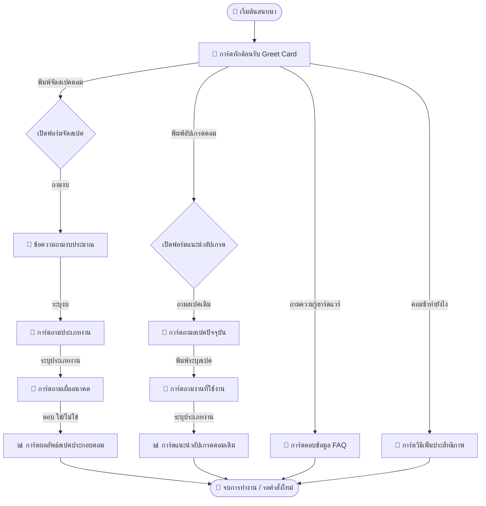

# S05: ภาพร่างโครงร่างหน้าจอและต้นแบบ (Wireframe and Prototype Specification)

---

## 1. แผนผังการนำทางและขั้นตอนการทำงานของผู้ใช้ (Navigation & User Flow)

แชทบอท SpecFlow ทำงานบนแพลตฟอร์มแอปพลิเคชัน LINE ซึ่งเป็นส่วนประสานงานผู้ใช้แบบแชท (Conversational UI) กระบวนการเปลี่ยนสถานะของหน้าจอหรือการแสดงการ์ด Flex Message (Navigation Flow) ควบคุมโดย Rasa Dialog Manager ดังแผนภูมิ Mermaid ต่อไปนี้:

### 1.1. แผนผังการนำทางบทสนทนา (Dialogue Navigation Flow)


---

## 2. โครงร่างหน้าจอแบบกล่องข้อความ (LINE Flex Message Wireframe Mockups)

เนื่องจากระบบทำงานอยู่ภายใต้ส่วนติดต่อผู้ใช้ของ LINE โปรแกรมจำลอง (Wireframe) จึงถูกออกแบบในกรอบโครงสร้าง LINE Flex Message (สไตล์ Dark Theme/Modern Gray) ซึ่งประกอบด้วยส่วนประกอบบล็อกเชิงกล่อง:

### 2.1. โครงร่างหน้าจอต้อนรับและช่วยเหลือเริ่มต้น (Greet Card Wireframe)
การ์ดทักทายแรกเมื่อเปิดหน้าแชท นำเสนอข้อมูลเมนูด่วนสำหรับสแกนสั่งงานอย่างรวดเร็ว:

```text
+-------------------------------------------------------------+
|                        [ SPECFLOW ]                         |
|                    (รูปภาพแผงวงจรคอมพิวเตอร์)               |
|                                                             |
|   สวัสดีครับ ยินดีต้อนรับสู่ SpecFlow                        |
|   บอทผู้ช่วยจัดสเปคและแนะนำอัปเกรดคอมพิวเตอร์อัตโนมัติ       |
|                                                             |
|   +-----------------------------------------------------+   |
|   |         [ 🖥️ จัดสเปคคอมพิวเตอร์ประกอบใหม่ ]         |   |
|   +-----------------------------------------------------+   |
|   |         [ 📈 วิเคราะห์และแนะนำการอัปเกรด ]           |   |
|   +-----------------------------------------------------+   |
|   |         [ 💡 คำแนะนำการจูนเครื่องซอฟต์แวร์ ]           |   |
|   +-----------------------------------------------------+   |
+-------------------------------------------------------------+
```

### 2.2. โครงร่างหน้าจอสอบถามข้อมูลเพื่อทำรายการ (Ask Usage / Ask Future Wireframe)
ปุ่มและตัวเลือก Quick Reply สำหรับถามข้อมูลประเภทงานใช้งานเพื่อป้องกันผู้ใช้พิมพ์ข้อมูลสะเปะสะปะ:

```text
+-------------------------------------------------------------+
|   [?] คุณต้องการนำคอมพิวเตอร์ไปใช้งานด้านไหนเป็นหลักครับ?   |
|                                                             |
|   +-------------------+  +--------------------+             |
|   |  🎮 เล่นเกมส์       |  |  🎨 กราฟิก/ตัดต่อ   |             |
|   +-------------------+  +--------------------+             |
|   |  💼 ทำงานออฟฟิศ   |                                     |
|   +-------------------+                                     |
+-------------------------------------------------------------+
```

### 2.3. โครงร่างหน้าจอนำเสนอสเปคประกอบคอมพิวเตอร์แนะนำ (Spec Builder Output Card Wireframe)
การ์ดหลักแสดงข้อมูลอุปกรณ์ 8 ชิ้นจำเป็น ราคารวม รายการแจ้งเตือนงบ และข้อสงวนDisclaimer:

```text
+-------------------------------------------------------------+
|   RECOMMENDATION                                            |
|   สเปคคอมพิวเตอร์แนะนำสำหรับ: <USAGE>                       |
|   -------------------------------------------------------   |
|   CPU      : <AMD/Intel CPU Model>           (<PRICE> ฿)    |
|   Mainboard: <Compatible Mainboard Model>    (<PRICE> ฿)    |
|   RAM      : <Compatible RAM Kit>            (<PRICE> ฿)    |
|   GPU      : <Graphics Card Model/None>      (<PRICE> ฿)    |
|   Storage  : <NVMe M.2 SSD>                  (<PRICE> ฿)    |
|   PSU      : <Validated PSU wattage>         (<PRICE> ฿)    |
|   Case     : <Compatible Chassis>            (<PRICE> ฿)    |
|   Cooler   : <Compatible CPU Air/AIO Cooler> (<PRICE> ฿)    |
|   -------------------------------------------------------   |
|   ราคารวมโดยประมาณ:                           <TOTAL> บาท   |
|   -------------------------------------------------------   |
|   ⚠️ คำเตือน: <กรณีจัดสเปคเกินงบสะสมไปเล็กน้อย>             |
|   -------------------------------------------------------   |
|   ⚠️ หมายเหตุ: ราคาเป็นเพียงการอ้างอิงทั่วไป ไม่รวมการประกัน  |
|   กรุณาตรวจสอบกับทางร้านผู้จัดจำหน่ายอีกครั้งก่อนประกอบ     |
+-------------------------------------------------------------+
```

### 2.4. โครงร่างหน้าจอนำเสนอการแนะนำอัปเกรดคอมพิวเตอร์เดิม (Upgrade Advisor Card Wireframe)
การ์ดหลักสรุปรายการชิ้นส่วนที่ควรเปลี่ยน ยอดรวมงบอัปเกรด และคำอธิบายแจ้งเตือนคอขวดระบบ:

```text
+-------------------------------------------------------------+
|   UPGRADE ADVISOR                                           |
|   แนวทางการอัปเกรดคอมพิวเตอร์เดิมของคุณ                      |
|   -------------------------------------------------------   |
|   รายการอัปเกรดแนะนำ:                                        |
|   • เพิ่ม RAM: อัปเกรดเป็น Kingston Beast 16GB  (1,400 ฿)     |
|   • เปลี่ยนใช้ SSD: ติดตั้ง WD SN580 1TB         (2,300 ฿)     |
|   -------------------------------------------------------   |
|   งบประมาณรวมการอัปเกรด:                      3,700 บาท     |
|   -------------------------------------------------------   |
|   💡 การวิเคราะห์คอขวดของระบบ (Bottleneck Analysis):         |
|   <ระบบชี้ผลการวิเคราะห์ เช่น CPU ทำงานช้ากว่าการ์ดจอมาก>       |
|   -------------------------------------------------------   |
|   ⚠️ หมายเหตุ: ราคาประเมินข้างต้นเป็นแนวทางเบื้องต้นเท่านั้น   |
+-------------------------------------------------------------+
```

---

## 3. รายละเอียดและคุณสมบัติของแต่ละหน้าจอ (Screen and Card Descriptions)

ข้อมูลรายละเอียดฟิลด์และการจัดวางส่วนอินเทอร์เฟซเชิงลึกของแต่ละเทมเพลต:

### 3.1. หน้าจอหลักและการทักทาย (Greet & Goodbye Cards)
* **รหัสไฟล์แม่แบบ:** `card_greet.json` และ `card_goodbye.json`
* **วัตถุประสงค์:** แสดงการเปิด/ปิดบทสนทนา พร้อมปุ่มนำทางด่วน (Quick Nav Buttons)
* **รายละเอียดส่วนประกอบ UI:**
  * **ภาพแบนเนอร์หลัก:** สื่อความเป็นแชทบอทไอที (IT SpecBot Theme)
  * **ข้อความทักทายสุ่ม:** สุ่มประโยคทักทายเพื่อความเป็นธรรมชาติในการคุย (ลดความจำเจในการใช้งานซ้ำ)
  * **Action Button:** ปุ่มแบบโพสต์แบ็ค (Postback actions) ทำหน้าที่ส่งข้อความคำสั่งแทนผู้ใช้งานเมื่อกดคลิก

### 3.2. หน้าจอรวบรวมข้อมูลอินพุต (Ask Data Cards)
* **รหัสไฟล์แม่แบบ:** `card_ask_usage.json`, `card_ask_current_specs.json`, และ `card_ask_future_upgrade.json`
* **วัตถุประสงค์:** แสดงการถามข้อมูล Slots ที่ Rasa ต้องการ พร้อมสร้างตัวเลือกจำกัดคำเพื่ออำนวยความสะดวกในโมเดล NLU
* **รายละเอียดส่วนประกอบ UI:**
  * **ภาพกล่องข้อความคำถาม:** ชี้แจงข้อมูลที่ผู้ใช้ต้องส่ง เช่น การพิมพ์ระบุ CPU หรือ GPU เดิม
  * **Quick Reply Buttons:** แสดงตัวเลือกที่พบบ่อย เช่น "ใช่" หรือ "ไม่" สำหรับระบบสอบถามเรื่องการอัปเกรดในอนาคต

### 3.3. หน้าจอนำเสนอรายการจัดแนะนำอุปกรณ์ (Result Recommendation Cards)
* **รหัสไฟล์แม่แบบ:** `card_spec_builder.json` และ `card_upgrade_advisor.json`
* **วัตถุประสงค์:** ทำหน้าที่จัดแสดงโครงสร้างรายการคอมพิวเตอร์ที่จัดสรรหรือรายการอัปเกรดที่ดีที่สุดให้ผู้ใช้สแกนอ่านราคาได้สะดวกรวดเร็ว
* **รายละเอียดส่วนประกอบ UI:**
  * **Dynamic Text Block:** ข้อความแสดงรายการอุปกรณ์ (ชื่อยี่ห้อ รุ่น ราคาแยกชิ้น) จัดแนวขนานข้าง (Horizontal Alignment) ซ้ายชื่อชิ้นส่วน ขวาราคา
  * **Warning Text Element (Conditional):** ส่วนเสริมแสดงข้อความระวังงบประมาณบานปลายสีแดงอ่อน จะปรากฏเฉพาะเมื่อระบบจำเป็นต้องคัดสรรอุปกรณ์ที่เกินงบประมาณตั้งต้นไปเล็กน้อย (เช่น จากการตรวจสอบ Socket และ TDP บังคับ)
  * **Bottleneck Analysis Section:** พื้นหลังกรอบสีเทาอ่อนแสดงบทวิเคราะห์คอขวดระบบเชิงลึกสำหรับตรรกะการอัปเกรด

### 3.4. หน้าจอสารสนเทศคลังความรู้ (FAQ Information Cards)
* **รหัสไฟล์แม่แบบ:** `card_faq_cpu.json`, `card_faq_gpu.json`, `card_faq_ram.json` และ `card_faq_ssd_hdd.json`
* **วัตถุประสงค์:** นำเสนอการอธิบายความรู้ทางเทคนิคของชิ้นส่วนฮาร์ดแวร์ไอทีเมื่อผู้ใช้ออกคำสั่งถาม เช่น "CPU คืออะไร"
* **รายละเอียดส่วนประกอบ UI:**
  * **Title Box:** แสดงชื่อชิ้นส่วนและรูปภาพโมเดลสามมิติของอุปกรณ์ (เช่น รูปการ์ดจอ หรือชิป)
  * **Paragraph Content:** ข้อความบรรยายสั้นๆ สุ่มได้ 3 รูปแบบความยาวประโยค เพื่อลดความเบื่อหน่ายของผู้ถาม
  * **Footer Navigation:** ปุ่มด่วนสำหรับถามชิ้นส่วนอื่นๆ ข้างเคียง
