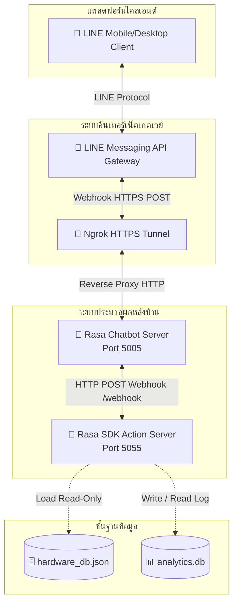
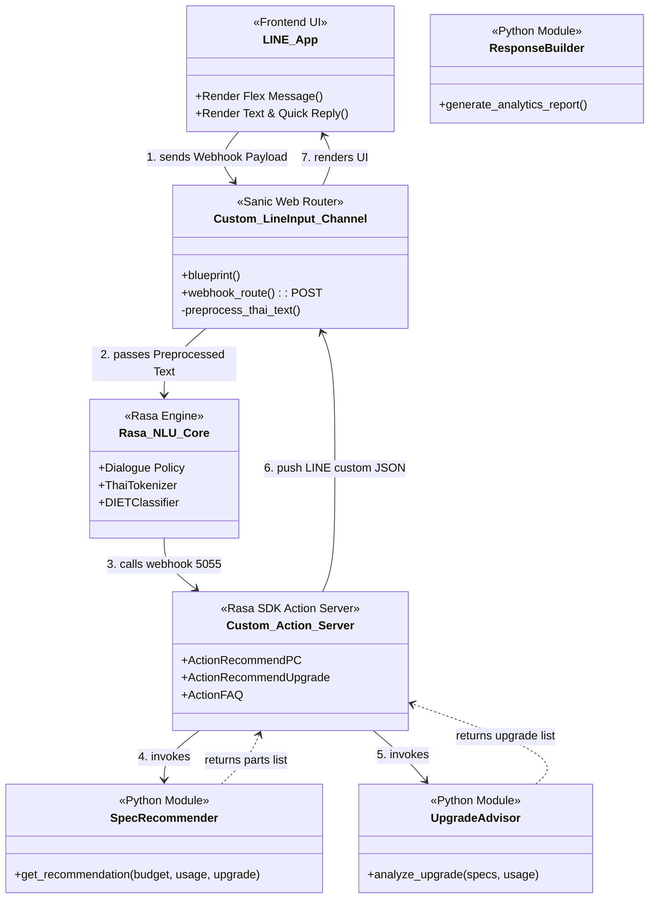

# S06: สถาปัตยกรรมระบบ (System Architecture Specification)

---

## 1. ภาพรวมสถาปัตยกรรมระบบ (System Architecture Overview)

ระบบแชทบอท SpecFlow ได้รับการออกแบบตามรูปแบบสถาปัตยกรรม **Client-Server Architecture** และการประมวลผลตรรกะแบบแยกส่วนบริการ (Service-Oriented Structure) โดยระบบมีกลไกหลักในการประสานงานระหว่างแอปพลิเคชัน LINE, เกตเวย์ Ngrok, เซิร์ฟเวอร์ Rasa NLU & Core, Rasa SDK Custom Actions Server และคลังเก็บฐานข้อมูล (SQLite & JSON) ดังแผนภาพบล็อกสถาปัตยกรรมระบบ:

---

## 2. สถาปัตยกรรมฝั่งหน้าบ้าน (Frontend Architecture)

เนื่องจากระบบนี้ถูกพัฒนาขึ้นเพื่อทำงานบนแพลตฟอร์มโปรแกรมแชทภายนอก (Third-party Messaging Platform) โครงสร้างหน้าบ้านจึงอิงกับสภาพแวดล้อมดังนี้:

1. **ส่วนประสานงานผู้ใช้ (User Interface Layer):** ทำงานอยู่บนแอปพลิเคชัน LINE (iOS, Android, Windows, macOS) ซึ่งรับหน้าที่เรนเดอร์โครงสร้างส่วนติดต่อผู้ใช้
2. **กลไกการแสดงผล (Rendering Engine):** ใช้กลไก **LINE Flex Message Rendering** ซึ่งเป็นการนำเอาชุดคำสั่งรูปแบบ JSON Payload ที่ถูกส่งไปจากเซิร์ฟเวอร์หลังบ้าน มาทำการแปลงองค์ประกอบกล่อง ข้อความ ขอบเขต และปุ่มกดให้แสดงผลแบบ Native Component บนเครื่องมือถือของฝั่งไคลเอนต์โดยตรง
3. **การเก็บสถานะหน้าบ้าน (Client-side Session):** ไม่มีการเก็บสถานะใดๆ ไว้บนหน้าบ้าน (Stateless Client) การบันทึกบริบทของการโต้ตอบและขั้นตอนของบทสนทนา (Conversation Context) จะถูกควบคุมและเก็บรักษาไว้ที่หน่วยความจำ Tracker Store ฝั่งเซิร์ฟเวอร์ Rasa ทั้งสิ้น

---

## 3. สถาปัตยกรรมฝั่งหลังบ้าน (Backend Architecture)

ฝั่งหลังบ้าน (Backend Server) พัฒนาขึ้นด้วยภาษา Python และเป็นศูนย์กลางในการประมวลผลทางด้านภาษาและการตัดสินใจ แบ่งการทำงานออกเป็น 3 ส่วนหลัก:

### 3.1. ส่วนประมวลผลภาษาและการสนทนา (Rasa Core & NLU Server)
* ทำหน้าที่เป็น "สมองส่วนหน้า" รันที่พอร์ต `5005` 
* **Rasa NLU (Natural Language Understanding):** ทำหน้าที่สกัด Intent และ Entities ผ่าน Pipeline การทำงานที่กำหนดใน `config.yml` โดยติดตั้ง Custom Tokenizer (`thai_tokenizer.py`) นำเอา PyThaiNLP มาช่วยตัดคำภาษาไทยแบบ `newmm` engine เพื่อให้เหมาะสมกับโครงสร้างภาษาแชทไทย
* **Rasa Core (Dialogue Management):** ควบคุมทิศทางบทสนทนาตามกฎ (Rules) และโครงเรื่อง (Stories) โดยนำเทคนิคแบบฟอร์ม (Forms) มาใช้ในการสกัด Slot ข้อมูลที่จำเป็น

### 3.2. ส่วนประมวลผลตรรกะประยุกต์ (Rasa SDK Action Server)
* ทำหน้าที่เป็น "สมองส่วนคำนวณ" รันที่พอร์ต `5055`
* รับสัญญาณเรียกประมวลผลจาก Rasa Core ผ่านทาง HTTP POST เมื่อแบบฟอร์มการเก็บค่า Slot ครบถ้วน
* รันโค้ดตรรกะเชิงวิศวกรรมคอมพิวเตอร์ใน `actions.py` เพื่อติดต่อประสานงานกับส่วนบริการภายนอก เช่น `SpecRecommender` และ `UpgradeAdvisor` เพื่อประเมินค่า

### 3.3. ส่วนช่องทางรับส่งข้อมูลกำหนดเอง (Custom Input/Output Channels)
* พัฒนาขึ้นในไฟล์ `line_channel.py` โดยเขียนโครงสร้าง Class `LineInput` ขยายขีดความสามารถของ InputChannel ใน Rasa
* ใช้ไลบรารีเฟรมเวิร์กเว็บ **Sanic (Asynchronous Web Server)** ในการเปิด Route Webhook รองรับคำสั่ง POST
* ใช้ **`line-bot-sdk`** สำหรับการตรวจสอบลายเซ็นความปลอดภัยและการ push ข้อความการ์ด Flex Message กลับหาผู้ใช้รายบุคคลอ้างอิงจาก User ID

---

## 4. สถาปัตยกรรมฐานข้อมูล (Database Architecture)

ระบบเลือกใช้โมเดลการจัดเก็บข้อมูลแบบผสม (Hybrid Datastore Model) เพื่อประสิทธิภาพและความรวดเร็วในการบริการ:

1. **คลังข้อมูลฮาร์ดแวร์จำลอง (Static JSON Store):**
   * จัดเก็บในไฟล์ JSON ที่ [hardware_db.json](file:///c:/Users/thirs/Downloads/SpecFlow/app/services/recommendation/hardware_db.json) ทำหน้าที่คล้ายฐานข้อมูลคลังสินค้าแบบอ่านอย่างเดียว (Read-Only Datastore) 
   * ข้อมูลจะถูกโหลดเข้าสู่หน่วยความจำ (Memory Cache) ในรูปของ Dictionary ของภาษา Python ตั้งแต่เริ่มเปิดระบบ ทำให้ความเร็วในการเข้าถึงข้อมูลเพื่อคัดสรรสเปคมีค่าความหน่วงต่ำกว่า 1 มิลลิวินาที (Sub-millisecond latency) และปลอดภัยจากการโจมตีประเภท SQL Injection
2. **ฐานข้อมูลสถิติประวัติทำรายการ (Dynamic SQLite Store):**
   * จัดเก็บในระบบฐานข้อมูลเชิงสัมพันธ์น้ำหนักเบาในไฟล์ [analytics.db](file:///c:/Users/thirs/Downloads/SpecFlow/data/analytics.db)
   * ทำหน้าที่เก็บบันทึกประวัติสืบค้นแบบเรียลไทม์ และใช้เพื่อการคำนวณสรุปค่าสถิติปริมาณ (Analytics API) สำหรับส่งต่อให้ระบบรายงานสถิติ

---

## 5. สถาปัตยกรรมการติดตั้งใช้งาน (Deployment Architecture)

ในระบบรุ่นพัฒนาปัจจุบัน (Version 0.3) สถาปัตยกรรมการติดตั้งใช้โครงสร้างแบบ Local Server ร่วมกับ Cloud Tunneling:

* **แอปพลิเคชันระบบหลังบ้าน (Rasa & Action Server):** รันบนเครื่องเซิร์ฟเวอร์ส่วนบุคคลหรือผู้พัฒนา โดยมีสคริปต์ `run.py` ควบคุมการเปิดโปรเซสย่อย (Subprocesses)
* **โปรโตคอลความปลอดภัยและการเชื่อมต่อภายนอก (Reverse Proxy Tunneling):** ใช้โปรแกรม Ngrok ในการทำหน้าต่างเชื่อมโยงเปิดช่องทางอุโมงค์ข้อมูลเปลี่ยนพอร์ต IP เครื่องที่พอร์ต `5005` ให้กลายเป็น Public HTTPS URL ชั่วคราว (เช่น `https://xxxx.ngrok-free.app`) เพื่อให้เซิร์ฟเวอร์ของ LINE สามารถยิง Webhook ลงมาประมวลผลในเครื่องพัฒนาได้

---

## 6. แผนภาพแสดงส่วนประกอบระบบ (Component Diagram)

แผนภาพอธิบายความสัมพันธ์และจุดเชื่อมโยง (Interfaces) ของส่วนประกอบภายในระบบ SpecFlow:

