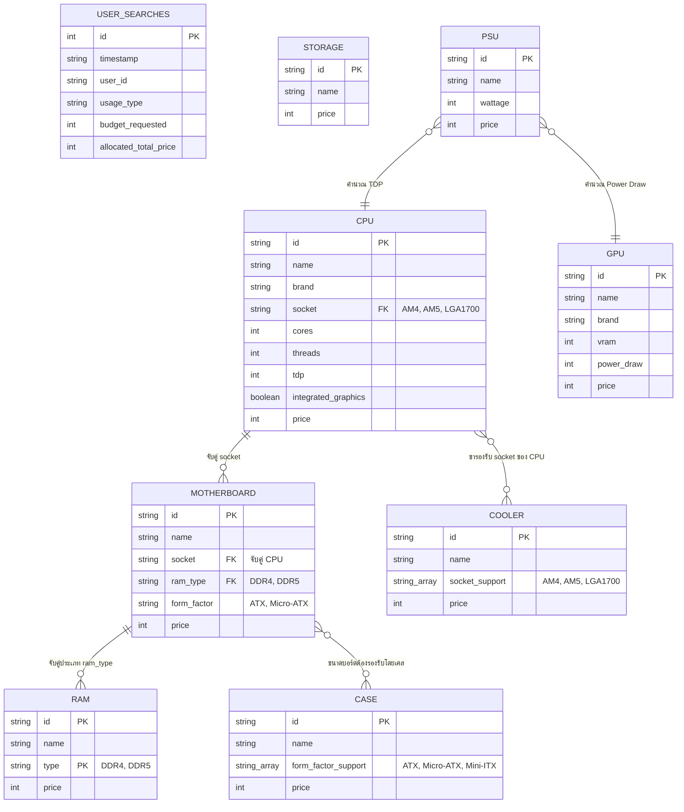

# S07: โครงสร้างฐานข้อมูลและพจนานุกรมข้อมูล (Database and Data Structure Specification)

---

## 1. แผนภาพแสดงความสัมพันธ์ของข้อมูล (Entity Relationship Diagram - ER Diagram)

ระบบ SpecFlow ใช้สถาปัตยกรรมฐานข้อมูลแบบผสม (Hybrid Database) ประกอบด้วย ฐานข้อมูลเชิงสัมพันธ์น้ำหนักเบา SQLite (`analytics.db`) และชุดข้อมูลจำลองโครงสร้างเชิงสัมพันธ์ที่ถูกจัดเก็บในรูปแบบไฟล์ JSON (`hardware_db.json`) 

เพื่อให้สอดคล้องกับรายงานระบบเชิงวิศวกรรม ข้อมูลอุปกรณ์ฮาร์ดแวร์ในไฟล์ JSON จะถูกแปลงและแสดงผลโครงสร้างความสัมพันธ์เชิงตรรกะ (Logical Relational Schema) เสมือนเป็นตารางฐานข้อมูลย่อยร่วมกับตารางสถิติใช้งาน ดังแผนภาพ ER Diagram ในรูปแบบ Mermaid:

---

## 2. พจนานุกรมข้อมูล (Data Dictionary)

รายละเอียดโครงสร้างคอลัมน์ ชนิดข้อมูล คีย์ และคำอธิบายความหมายของตารางและคอลเลกชันทั้งหมดในระบบ:

### 2.1. ตารางประวัติการทำธุรกรรมค้นหา: `user_searches` (SQLite Database)
ทำหน้าที่เก็บประวัติธุรกรรมเพื่อนำข้อมูลมาใช้สรุปสถิติวินิจฉัย:

| ชื่อฟิลด์ (Field Name) | ชนิดข้อมูล (Data Type) | ข้อจำกัดคีย์ (Key Constraints) | คำอธิบาย (Description) |
| :--- | :--- | :--- | :--- |
| `id` | INTEGER | PRIMARY KEY AUTOINCREMENT | รหัสระบุรายการอ้างอิงอัตโนมัติ (เริ่มต้นที่ 1) |
| `timestamp` | TEXT (DATETIME) | NOT NULL | วันและเวลาที่เริ่มบันทึกรายการ (รูปแบบ `YYYY-MM-DD HH:MM:SS`) |
| `user_id` | TEXT | NOT NULL | รหัสผู้ใช้งาน LINE Client (UID) |
| `usage_type` | TEXT | NOT NULL | รูปแบบงานที่ใช้จัดสเปค ("เล่นเกม", "กราฟิก", "ออฟฟิศ") |
| `budget_requested` | INTEGER | NOT NULL | ยอดงบประมาณเงินบาทที่ผู้ใช้ร้องขอมา |
| `allocated_total_price`| INTEGER | NOT NULL | ราคาสรุปผลรวมอุปกรณ์จัดซื้อประกอบจริงของระบบ |

---

### 2.2. ตารางเสมือนคลังข้อมูลอุปกรณ์คอมพิวเตอร์ (JSON Datastore)

#### A. ตารางเสมือน: `cpu`
จัดเก็บรายการตัวเลือกและคุณสมบัติของหน่วยประมวลผลกลาง:

| ชื่อฟิลด์ (Field Name) | ชนิดข้อมูล (Data Type) | ข้อจำกัดคีย์ (Key Constraints) | คำอธิบาย (Description) |
| :--- | :--- | :--- | :--- |
| `id` | VARCHAR(10) | PRIMARY KEY | รหัสฮาร์ดแวร์เฉพาะ (เช่น cpu001) |
| `name` | VARCHAR(100) | NOT NULL | ชื่อยี่ห้อและรุ่นสินค้า (เช่น Intel Core i5-12400F) |
| `brand` | VARCHAR(20) | NOT NULL | ค่ายผู้ผลิตสินค้า ("AMD", "Intel") |
| `socket` | VARCHAR(20) | FOREIGN KEY | ประเภทฐานรองรับขาต่อ ("AM4", "AM5", "LGA1700") |
| `cores` | INTEGER | NOT NULL | จำนวนแกนประมวลผลทางกายภาพ |
| `threads` | INTEGER | NOT NULL | จำนวนแกนทำงานเสมือน |
| `tdp` | INTEGER | NOT NULL | อัตราการคายพลังงานความร้อนเชิงออกแบบ (วัตต์) |
| `integrated_graphics` | BOOLEAN | NOT NULL | มีชิปกราฟิกในตัว CPU หรือไม่ (True/False) |
| `price` | INTEGER | NOT NULL | ราคาสินค้าอ้างอิงเป็นบาท |

#### B. ตารางเสมือน: `motherboard`
จัดเก็บรายการและข้อมูลการเข้าคู่ของแผงวงจรหลัก:

| ชื่อฟิลด์ (Field Name) | ชนิดข้อมูล (Data Type) | ข้อจำกัดคีย์ (Key Constraints) | คำอธิบาย (Description) |
| :--- | :--- | :--- | :--- |
| `id` | VARCHAR(10) | PRIMARY KEY | รหัสเมนบอร์ด (เช่น mb001) |
| `name` | VARCHAR(100) | NOT NULL | ชื่อยี่ห้อและรุ่น (เช่น ASUS PRIME B550M-A) |
| `socket` | VARCHAR(20) | FOREIGN KEY | ประเภท Socket ที่เชื่อมต่อ CPU ได้ ("AM4", "AM5", "LGA1700") |
| `ram_type` | VARCHAR(10) | FOREIGN KEY | เทคโนโลยีแรมที่รองรับบนบอร์ด ("DDR4", "DDR5") |
| `form_factor` | VARCHAR(20) | NOT NULL | ขนาดโครงสร้างแผงวงจร ("ATX", "Micro-ATX") |
| `price` | INTEGER | NOT NULL | ราคาสินค้าอ้างอิงเป็นบาท |

#### C. ตารางเสมือน: `ram`
จัดเก็บข้อมูลหน่วยความจำชั่วคราวคอมพิวเตอร์:

| ชื่อฟิลด์ (Field Name) | ชนิดข้อมูล (Data Type) | ข้อจำกัดคีย์ (Key Constraints) | คำอธิบาย (Description) |
| :--- | :--- | :--- | :--- |
| `id` | VARCHAR(10) | PRIMARY KEY | รหัสหน่วยความจำ (เช่น ram001) |
| `name` | VARCHAR(100) | NOT NULL | ชื่อรุ่นและความจุแรม (เช่น Kingston DDR4 16GB) |
| `type` | VARCHAR(10) | FOREIGN KEY | เทคโนโลยีการทำงาน ("DDR4", "DDR5") |
| `price` | INTEGER | NOT NULL | ราคาสินค้าอ้างอิงเป็นบาท |

#### D. ตารางเสมือน: `gpu`
จัดเก็บข้อมูลตัวเลือกของการ์ดแสดงผลกราฟิกแยก:

| ชื่อฟิลด์ (Field Name) | ชนิดข้อมูล (Data Type) | ข้อจำกัดคีย์ (Key Constraints) | คำอธิบาย (Description) |
| :--- | :--- | :--- | :--- |
| `id` | VARCHAR(10) | PRIMARY KEY | รหัสการ์ดจอ (เช่น gpu001) |
| `name` | VARCHAR(100) | NOT NULL | ชื่อรุ่นสินค้าการ์ดจอแยก (เช่น NVIDIA RTX 4060) |
| `brand` | VARCHAR(20) | NOT NULL | ค่ายผู้ผลิตชิปกราฟิก ("NVIDIA", "AMD") |
| `vram` | INTEGER | NOT NULL | ขนาดแรมการ์ดจอหน่วยเป็น GB |
| `power_draw` | INTEGER | NOT NULL | ความต้องการพลังงานไฟขั้นต่ำ (วัตต์) |
| `price` | INTEGER | NOT NULL | ราคาสินค้าอ้างอิงเป็นบาท |

#### E. ตารางเสมือนเพิ่มเติม: `storage`, `psu`, `case`, และ `cooler`
* **`storage`:** ฟิลด์ `id` (PK), `name`, `price`
* **`psu`:** ฟิลด์ `id` (PK), `name`, `wattage` (จำนวนวัตต์จ่ายไฟสูงสุด), `price`
* **`case`:** ฟิลด์ `id` (PK), `name`, `form_factor_support` (ชนิดอาร์เรย์รองรับขนาดบอร์ด เช่น `["ATX", "Micro-ATX"]`), `price`
* **`cooler`:** ฟิลด์ `id` (PK), `name`, `socket_support` (ชนิดอาร์เรย์ Socket ซีพียูที่ติดยึดพัดลมได้ เช่น `["AM4", "AM5", "LGA1700"]`), `price`

---

## 3. ความสัมพันธ์ คีย์หลัก และคีย์นอก (Keys and Relationships)

โครงสร้างฐานข้อมูลคอมพิวเตอร์มีการควบคุมความถูกต้องของข้อมูล (Referential Integrity) ผ่านการตั้งกฎเชื่อมโยงทางคีย์ในการประมวลผลของภาษา Python (เนื่องจาก JSON ไม่มี RDBMS engine คอยจับ):

1. **การตรวจสอบความเข้ากันได้ทางกายภาพของหน่วยประมวลผล (CPU-Motherboard Link):**
   * ความสัมพันธ์ระหว่างตาราง `cpu` และ `motherboard` เชื่อมโยงผ่านคอลัมน์คีย์นอก `socket` แบบ Many-to-One 
   * *ตรรกะตรวจสอบ:* $\text{cpu.socket} == \text{motherboard.socket}$
2. **การจับคู่ประเภทหน่วยความจำ (Motherboard-RAM Link):**
   * เชื่อมโยงผ่านประเภทเทคโนโลยีหน่วยความจำ คีย์ `motherboard.ram_type` เข้ากับคีย์ `ram.type`
   * *ตรรกะตรวจสอบ:* $\text{motherboard.ram_type} == \text{ram.type}$
3. **การประเมินขนาดทางกายภาพกับเคสเครื่องคอมพิวเตอร์ (Motherboard-Case Link):**
   * เชื่อมโยงขนาดตัวเมนบอร์ด `motherboard.form_factor` กับค่าอาร์เรย์คุณสมบัติ `case.form_factor_support`
   * *ตรรกะตรวจสอบ:* $\text{motherboard.form_factor} \in \text{case.form_factor_support}$
4. **ความพอดีของการจ่ายพลังงาน (PSU Constraint Validation):**
   * คำนวณความพอดีโดยไม่มีความสัมพันธ์เชิงกิ่งคีย์โดยตรง แต่เป็นการคำนวณผ่านการเปรียบเทียบค่าเชิงตัวเลข (Greater-than Validation Rule)
   * *ตรรกะตรวจสอบ:* $\text{psu.wattage} \ge (\text{cpu.tdp} + \text{gpu.power\_draw} + 100\text{W})$

---

## 4. การทำให้ฐานข้อมูลอยู่ในรูปแบบปกติ (Normalization)

การออกแบบโครงสร้างคลังข้อมูลอุปกรณ์จัดสรรชิ้นส่วน ได้ดำเนินการทำ Normalization เพื่อประสิทธิภาพและความถูกต้องของข้อมูล:

### 4.1. การทำให้เป็นรูปแบบปกติระดับที่ 1 (1NF - First Normal Form)
* ทุกแอตทริบิวต์ในแถวข้อมูลของ SQLite และ JSON เป็นค่าที่ไม่สามารถแยกย่อยได้อีก (Atomic values)
* ไม่มีกลุ่มแอตทริบิวต์ที่ซ้ำซ้อนกันในแถวเดียว
* *ข้อยกเว้นเชิงออกแบบ:* ฟิลด์ `form_factor_support` ของเคส และ `socket_support` ของ Cooler ถูกเก็บในรูป Array (JSON Array) เพื่อความสะดวกในการโหลด Cache ซึ่งถือเป็นโครงสร้างปกติในฐานข้อมูลแบบ Document-based (NoSQL style)

### 4.2. การทำให้เป็นรูปแบบปกติระดับที่ 2 และ 3 (2NF & 3NF)
* ข้อมูลอุปกรณ์ฮาร์ดแวร์ถูกแยกประเภทออกจากกันเป็นตารางจำเพาะ (Decoupled Tables) เช่น แยกหน่วยประมวลผล แยกแผงวงจรหลัก แยกแรม ไม่ได้นำข้อมูล CPU ไปบันทึกปะปนในตาราง Motherboard
* แอตทริบิวต์ที่มิใช่คีย์หลัก (Non-key Attributes) ทั้งหมด ขึ้นตรงต่อคีย์หลักของตารางของตนเองโดยตรง (Fully Functionally Dependent on Primary Key) และไม่มีความสัมพันธ์แบบส่งทอด (No Transitive Dependencies) ส่งผลให้โครงสร้างฐานข้อมูล SpecFlow อยู่ในเกณฑ์ **3NF (Third Normal Form)** 
* **ประโยชน์:** ป้องกันความผิดปกติในการจัดการข้อมูล (Data Anomaly) เช่น เมื่อมีรุ่น CPU ใหม่เข้ามา สามารถเพิ่มได้ทันทีโดยไม่ต้องไปสร้างข้อมูล Motherboard ใหม่ หรือการปรับเปลี่ยนราคา GPU ก็จะไม่มีผลกระทบต่อประวัติการซื้อในตาราง SQLite อดีต
