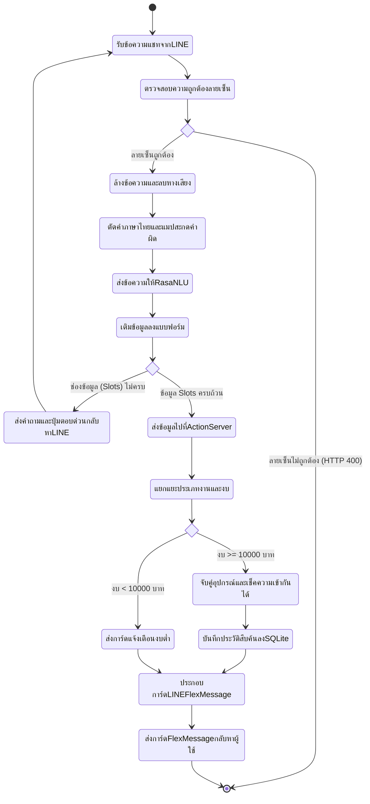
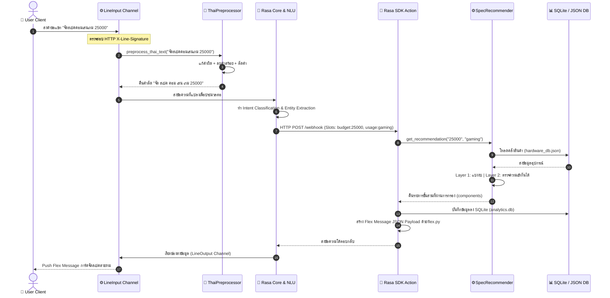
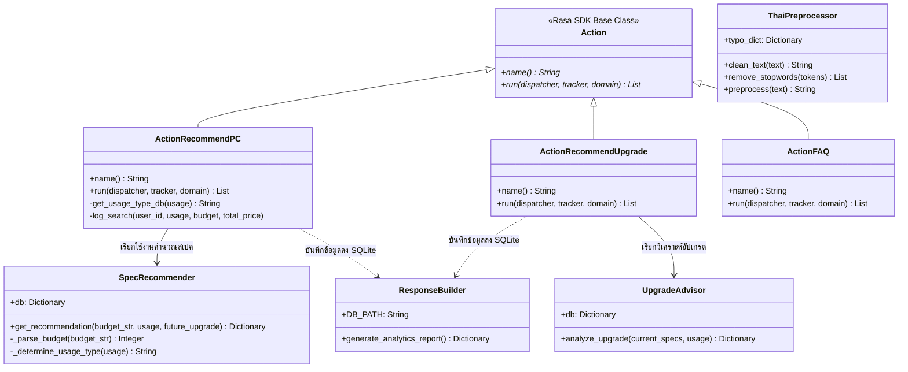

# S08: การออกแบบกระบวนการ, UML, และข้อกำหนด API (Process, UML, and API Design Specification)

---

## 1. แผนภาพกระบวนการทำงาน (Activity Diagram)

แผนภาพกิจกรรมการประมวลผลคำขอจัดสเปคคอมพิวเตอร์ผ่านทาง LINE Chatbot ตั้งแต่รับอินพุต ตรวจวิเคราะห์ จนถึงส่งการ์ดข้อมูลคืนกลับ แสดงในรูปแบบ Mermaid Activity Diagram:



---

## 2. แผนภาพลำดับขั้นตอนการทำงาน (Sequence Diagram)

ลำดับการเรียกใช้งานฟังก์ชันข้ามออบเจกต์ (Objects Interaction) ในโปรเซสประมวลผลการจัดสเปคคอมพิวเตอร์:



---

## 3. แผนภาพแสดงโครงสร้างคลาส (Class Diagram)

สัญกรณ์แสดงความสัมพันธ์ โครงสร้างตัวแปร และฟังก์ชันภายในซอร์สโค้ดภาษา Python ของโปรเจกต์ SpecFlow:



---

## 4. ข้อกำหนดส่วนติดต่อการใช้งานโปรแกรม (API Specifications)

### 4.1. ช่องทางส่งข้อมูลแชท: LINE Webhook Gateway
* **Endpoint (URL):** `/webhooks/line/webhook`
* **โปรโตคอลการเข้าถึง:** HTTP POST (HTTPS เท่านั้นบนระบบจำหน่ายจริง)
* **รูปแบบการยืนยันตัวตน:** ตรวจสอบลายเซ็นผ่าน HTTP Header `X-Line-Signature`

#### ตัวอย่างโครงสร้างข้อมูลร้องขอ (Request Body Schema)
```json
{
  "destination": "U1234567890abcdef1234567890abcde",
  "events": [
    {
      "type": "message",
      "message": {
        "type": "text",
        "id": "14275892",
        "text": "จัดสเปคคอมงบ 30000 เล่นเกม"
      },
      "timestamp": 1626901857321,
      "source": {
        "type": "user",
        "userId": "U4a8a9b2c3d4e5f6g7h8i9j0k1l2m3n4"
      },
      "replyToken": "nH7bEs16a2IGJydAxZ71"
    }
  ]
}
```
#### โครงสร้างข้อมูลตอบรับ (Response)
* **HTTP Status Code:** `200 OK` (ยืนยันรับข้อความเสร็จสิ้นเพื่อไม่ให้ LINE ยิงคำสั่งซ้ำ)
* **ข้อความตอบรับ:** `OK` (Text)

---

### 4.2. ช่องทางแลกเปลี่ยนคำนวณ: Rasa Custom Action Webhook
* **Endpoint (URL):** `http://127.0.0.1:5055/webhook`
* **โปรโตคอลการเข้าถึง:** HTTP POST
* **รูปแบบข้อมูลร้องขอ:** Rasa SDK Request Payload (Tracker State JSON)

#### ตัวอย่างข้อมูลร้องขอ (Request Body Schema)
```json
{
  "next_action": "action_recommend_pc",
  "sender_id": "U4a8a9b2c3d4e5f6g7h8i9j0k1l2m3n4",
  "tracker": {
    "sender_id": "U4a8a9b2c3d4e5f6g7h8i9j0k1l2m3n4",
    "slots": {
      "budget": "30000",
      "usage": "เล่นเกม",
      "future_upgrade": true
    },
    "latest_message": {
      "intent": {
        "name": "build_pc",
        "confidence": 0.96
      }
    }
  }
}
```

#### ตัวอย่างข้อมูลตอบรับเมื่อประมวลผลเสร็จ (Response Body Schema)
คืนค่ารายการผลลัพธ์เป็นอาร์เรย์ของคำสั่งข้อความหรือบล็อก Custom Flex Message JSON กลับไปให้ Rasa Core:

```json
{
  "responses": [
    {
      "custom": {
        "type": "flex",
        "altText": "แนะนำสเปคคอมพิวเตอร์งบ 30,000 บาท",
        "contents": {
          "type": "bubble",
          "body": {
            "type": "box",
            "layout": "vertical",
            "contents": [
              {
                "type": "text",
                "text": "แนะนำสเปคคอมสำหรับ เล่นเกม",
                "weight": "bold",
                "size": "lg"
              },
              {
                "type": "separator"
              },
              {
                "type": "text",
                "text": "CPU: Intel Core i5-12400F (4,600 ฿)"
              }
            ]
          }
        }
      }
    }
  ],
  "events": [
    {"event": "slot", "value": null, "name": "budget"},
    {"event": "slot", "value": null, "name": "usage"},
    {"event": "slot", "value": null, "name": "future_upgrade"}
  ]
}
```
*(หมายเหตุ: ระบบจะทำการ Reset คืนค่า Slots ทุกตัวให้เป็น Null ในบล็อก `events` ทันทีหลังจัดสเปคเสร็จ เพื่อเตรียมความพร้อมสำหรับผู้ใช้ส่งคำสั่งจัดคอมรอบใหม่ในแชทเดิม)*
