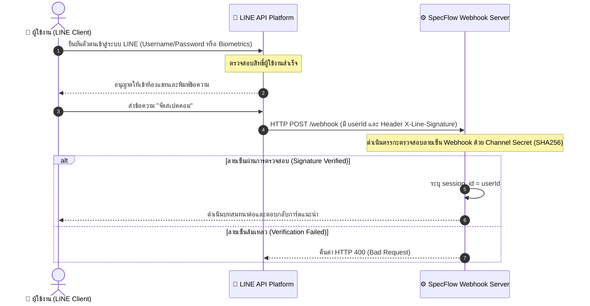

# S10: ระบบบัญชี สิทธิ์ และการยืนยันตัวตน (Authentication and Access Control Specification)

---

## 1. การยืนยันตัวตนผู้ใช้งาน (User Authentication Flow)

เนื่องจากระบบแชทบอท SpecFlow ถูกฝังตัวรันอยู่อยู่บนแพลตฟอร์มของแอปพลิเคชัน LINE (LINE Platform Client) ระบบจึงใช้แนวคิดการยืนยันตัวตนแบบ **Federated Identity/Platform-level Authentication** โดยมอบความรับผิดชอบในการตรวจพิสูจน์บุคคล (Authentication) ให้แก่ระบบของ LINE 

ระบบจำแนกผู้ใช้และสถาปัตยกรรมยืนยันสิทธิ์ตามแผนภาพลำดับขั้นต่อไปนี้:

### รายละเอียดระบบตรวจความปลอดภัยของเส้นทาง (Webhook Signature Validation)
เพื่อป้องกันผู้ไม่หวังดีส่งคำร้องขอปลอมแปลง (HTTP Request Spoofing) มาที่ระบบหลังบ้าน ระบบได้ทำการยืนยันสิทธิ์ความปลอดภัยในตัวรับสัญญาณ `LineInput` ในไฟล์ [line_channel.py](file:///c:/Users/thirs/Downloads/SpecFlow/app/rasa/line_channel.py) ดังนี้:
1. ระบบดึงค่ารหัสลายเซ็นตรวจสอบสิทธิ์ใน HTTP Header ชื่อ `X-Line-Signature`
2. ระบบเรียกใช้ฟังก์ชัน `WebhookParser(channel_secret).parse(body, signature)`
3. ฟังก์ชันจะทำการเข้ารหัสข้อความดิบ (Request Body) แบบ HMAC-SHA256 ด้วย `channel_secret` ที่บันทึกไว้ และนำไปเปรียบเทียบกับ signature หากตรงกันจึงอนุญาตให้ข้อมูลเข้าสู่กระบวนการพรีโปรเซสภาษาไทย

---

## 2. การกำหนดสิทธิ์และบทบาทผู้ใช้ (Authorization & User Roles)

ระบบจำแนกบทบาทและสิทธิ์ในการควบคุมสารสนเทศออกเป็น **2 บทบาทหลัก (System Roles)** เพื่อป้องกันการเข้าถึงข้อมูลที่ผิดพลาด:

| บทบาทผู้ใช้ (System Role) | สิทธิ์การเข้าถึงและการจัดการ (Permissions) | ช่องทางการทำงาน (Channel) |
| :--- | :--- | :--- |
| **ผู้ใช้งานทั่วไป (End User)** | • เรียกใช้ฟังก์ชันจัดสเปคคอมพิวเตอร์และอัปเกรด • ค้นหาข้อมูลความรู้ FAQ ด้านฮาร์ดแวร์ไอที • ไม่มีสิทธิ์เข้าถึงหรือแก้ไขฐานข้อมูล SQLite และไฟล์ JSON | แอปพลิเคชัน LINE (สมาร์ตโฟน/เดสก์ท็อป) |
| **ผู้ดูแลระบบ / นักพัฒนา (Admin / Developer)**| • อัปเดต แก้ไข และลบข้อมูลอะไหล่ใน `hardware_db.json` • ฝึกสอนและสั่งเทรนโมเดลแชทบอทผ่านชุดคำสั่ง `rasa train` • รันสคริปต์ `analytics_report.py` เพื่ออ่านประวัติสถิติสืบค้น | หน้าคอนโซลของระบบเซิร์ฟเวอร์หลังบ้าน (Command Line Interface - CLI) |

---

## 3. การจัดการเซสชันบทสนทนา (Session Management & Tracker Store)

เนื่องจากการสนทนาของแชทบอทจำเป็นต้องเก็บบริบทต่อเนื่อง (เช่น การตอบคำถามงบประมาณย้อนหลัง) ระบบจึงมีการจัดการเซสชันดังนี้:

1. **การจำแนกไอดีเซสชัน (Session Identifier):**
   * ระบบใช้ค่า `userId` ที่ส่งมาจาก LINE Webhook (ซึ่งเป็นค่าสตริงแฮชเฉพาะตัวของผู้ใช้งานแต่ละคนที่ไม่ซ้ำกัน) มากำหนดเป็น `sender_id` ในระบบของ Rasa
2. **การจัดเก็บประวัติโต้ตอบชั่วคราว (Tracker Store):**
   * ข้อมูล Slot, ขั้นตอนของบทสนทนาที่กำลังโต้ตอบ และประวัติข้อความจะถูกบันทึกไว้ในระบบหน่วยความจำ **Tracker Store** ของ Rasa ซึ่งจะทำงานแบบผูกกับ `sender_id`
   * การส่งคำร้องขอย้อนกลับในหน้าแชทเดียวกันจะสามารถเข้าถึงบริบทเดิมได้โดยไม่ต้องเข้าสู่ระบบซ้ำ
3. **การคืนค่าข้อมูลในเซสชัน (Session Resetting):**
   * ทันทีที่การประมวลผลจัดสเปค (`ActionRecommendPC`) หรือการวิเคราะห์อัปเกรด (`ActionRecommendUpgrade`) ดำเนินการส่งผลการ์ด Flex Message ให้ผู้ใช้เสร็จสิ้น ระบบจะส่งคำสั่ง **SlotSet** เพื่อคืนค่า Slot ทุกตัว (`budget`, `usage`, `future_upgrade`, `current_specs`) ให้กลับเป็นค่าว่าง `None` ทันที 
   * **เหตุผลทาง UX:** ป้องกันการปนเปื้อนของข้อมูลเดิมในการจัดสเปคหรือการคำนวณในบทสนทนารอบถัดไปในห้องแชทเดิม
4. **นโยบายหมดอายุเซสชัน (Session Timeout Policy):**
   * ตามคอนฟิกูเรชันมาตรฐานของ Rasa เซสชันของบทสนทนาจะคงอยู่ได้สูงสุด **60 นาที** หากไม่มีข้อความใหม่ส่งมาจากผู้ใช้งาน เซสชันจะหมดอายุโดยอัตโนมัติ และจะทำการล้าง Slots รวมทั้งเริ่มต้นบทสนทนาใหม่เมื่อผู้ใช้พิมพ์เข้ามาในครั้งถัดไป
